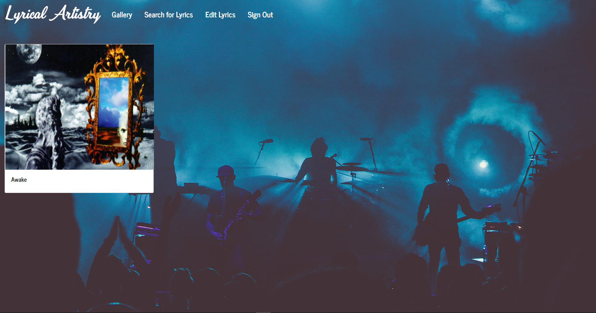
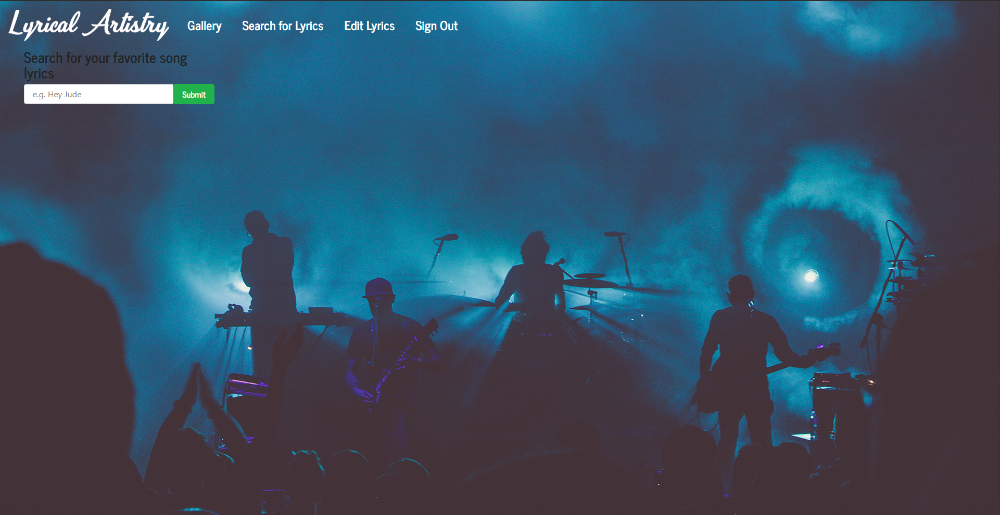
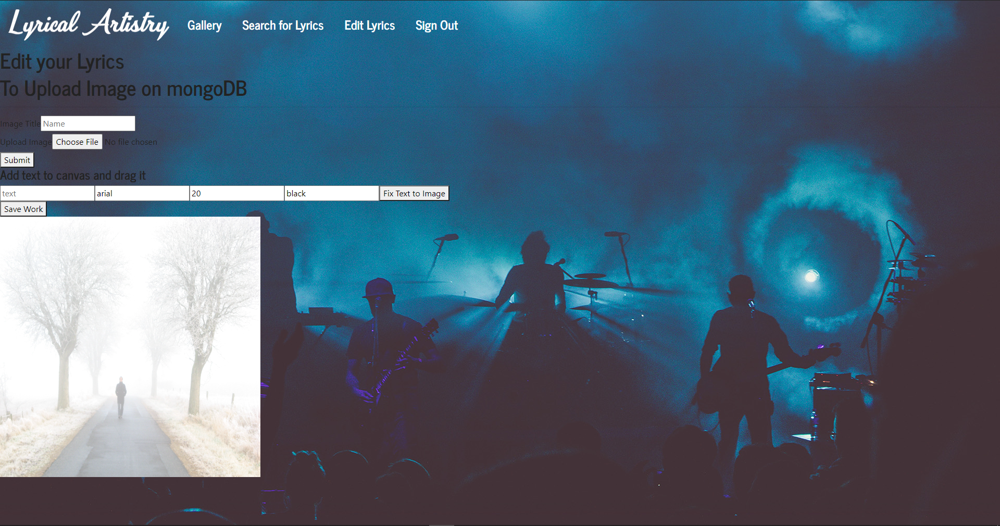

# Lyrical Artistry

* [How it works](#work)
* [Install](#install)
* [Credits](#credits)
* [License](#license)
# How it works 
Creating simple art pieces to display their favorite lyrics over their images and save them to their gallery.
# Deployed App
https://lyrical-artistry.herokuapp.com/
## Instructions
Search for a song and select the lyrics you would like to use. Then display those lyrics over a image you choose and edit the text. After your image is done save that image to your gallery.  
## Credits
Elijah Davis, Brandon Craig, Eric Chen, Anzel Capparelli
## License 
N/A
## Reporting issues and making contributions 
Report issues at https://github.com/bcraig-13/lyrical-artistry/issues
## Contact
* Github : ElijahIG
* Github : bcraig-13
* Github : EricChen96
* Github : anzelcapparelli
# Images of Deployed App





# Starting the app locally

Add a .env to the `/server` folder of this app.

Then inside of the .env add a SERVER_SECRET set to any value you'd like

```
SERVER_SECRET = 112345
MUSIXMATCH_KEY= GET MUSIXMATCH SERVER API KEY
```

First off make sure you have a local version of MongoDB running on your machine. This project will make a local database for you called `appDB`. (You may want to rename the local database to something else.)

Start by installing front and backend dependencies. While in the root directory, run the following command:

```
npm install
```

After all installations complete, run the following command in your terminal:

```
npm start
```

That's it, your app should be running on <http://localhost:3000>. The Express server should intercept any AJAX requests from the client.